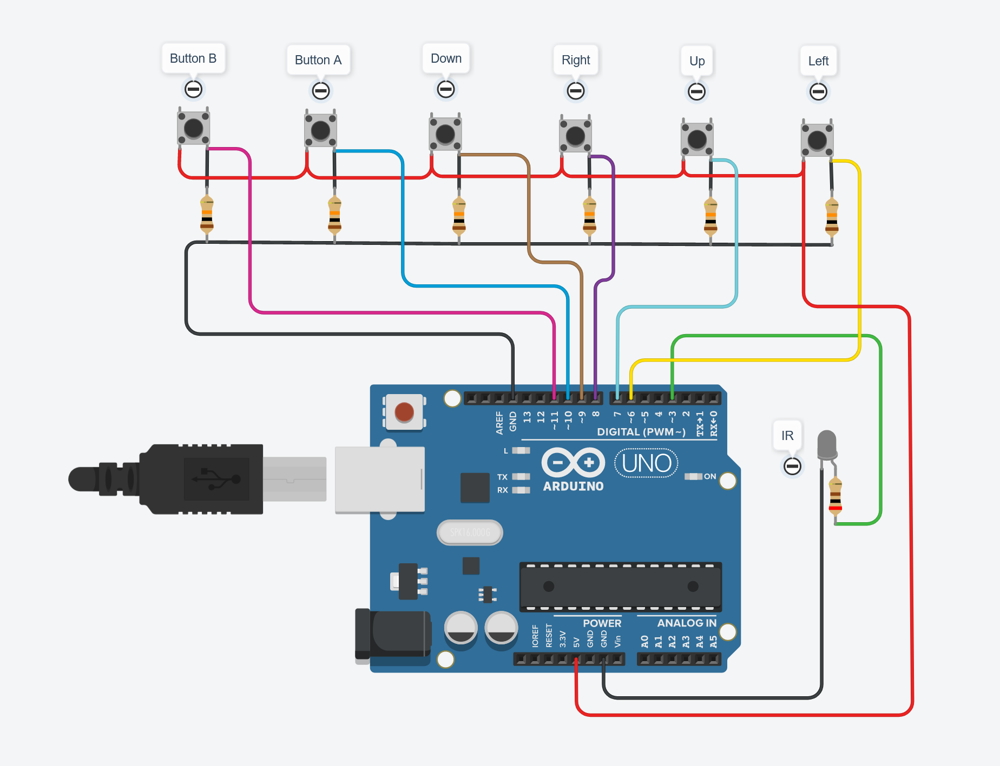

# A replacement infrared gamepad for the Bandai Playdia console using an Arduino.

@author: alx5962

## About

I enjoy fixing old consoles and give them back some life and love. I got my hands on a working Playdia but unluckily the infrared gamepad was missing. It's almost impossible to find one these days. So I tried to find a way to recreate one, document the process and share it.

This gamepad works on my Playdia, I played several games with it (Playdia demo disc, DBZ, Sailor Moon). The main issue is related to the infrared side: it only works close to the console sensor for now.

## Dependencies

The Arduino IRRemote library is used in this project: https://github.com/Arduino-IRremote/Arduino-IRremote

Import this library into the Arduino IDE (available in the Library Manager section) before compiling the project .

## Arduino wiring

## Compatibility

This code has been tested on: Arduino UNO R3 and Arduino Nano (clones and official ones).

## TODO

Optimize code and infrared timing.

## Thanks

A big thank you to Darius Saturn for his help.
